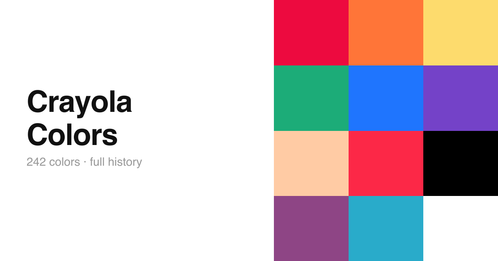

# Crayola Colors

An interactive browser for all 242 Crayola crayon colors, built with React and Vite. Browse every color with its full production history, previous names, scented and glitter variants, and color values.

[](https://marchdoe.github.io/colors/)

**[→ View the site](https://marchdoe.github.io/colors/)**

---

## What it does

Each color page shows:

- **Name and hex value** — the official Crayola name and approximate hex
- **Status and collection badges** — whether the color is current or retired, and which collection it belongs to (Standard, Munsell, Fluorescent, Silver Swirls, Gem Tones, Pearl Brite)
- **Year range** — when the color was introduced and, if retired, when it was discontinued
- **Also known as** — previous names with the years each name was in use
- **Variants** — scented (🌿) and glitter (✨) versions released under different product lines
- **RGB and HSV values** — precise color space coordinates

Two view modes are available:

- **Classic** — white header panel above a full-height color swatch
- **Immersive** — full-viewport color background with an overlay anchored to the bottom; text color automatically adapts for legibility based on WCAG contrast ratio

Keyboard navigation (← →) moves between colors. View mode preference is persisted in `localStorage`.

---

## Data

Colors are sourced from two places:

- **Hex values and color space data** — reconciled 1:1 with the [Wikipedia list of Crayola crayon colors](https://en.wikipedia.org/wiki/List_of_Crayola_crayon_colors)
- **Historical data** — production years, name changes, and variants sourced from [Jenny's Crayon Collection](https://www.jennyscrayoncollection.com)

The enriched dataset lives in `src/colors-enriched.json` (242 colors). Each entry includes:

```json
{
  "introduced": 1903,
  "retired": null,
  "status": "current",
  "collection": "standard",
  "nameHistory": [{ "name": "Flesh Tint", "from": 1903, "to": 1949 }],
  "variants": [{ "name": "Saw Dust", "year": 1997, "type": "scented", "collection": "Color 'n Smell" }]
}
```

Hex values for Silver Swirls, Gem Tones, and Pearl Brite collections are approximate (`hexApproximate: true`).

---

## Tech stack

| | |
|---|---|
| Framework | React 19 |
| Build tool | Vite 7 |
| Routing | React Router |
| Testing | Vitest + Testing Library |
| Deploy | GitHub Pages (`gh-pages`) |

---

## Getting started

```bash
npm install
npm run dev        # dev server at localhost:5173
npm test           # run tests
npm run build      # production build
npm run deploy     # build + push to gh-pages
```

---

## Project structure

```
src/
  App.jsx                  # routing, keyboard nav, mode persistence
  ColorDisplay.jsx         # color page layout (classic + immersive)
  colors-enriched.json     # 242-color dataset with historical data
  index.css                # all styles
  useColorQueue.js         # navigation queue hook
  useLocalStorage.js       # localStorage persistence hook
scripts/
  generate-enriched.js     # generated colors-enriched.json from colors.json + manual data
```
